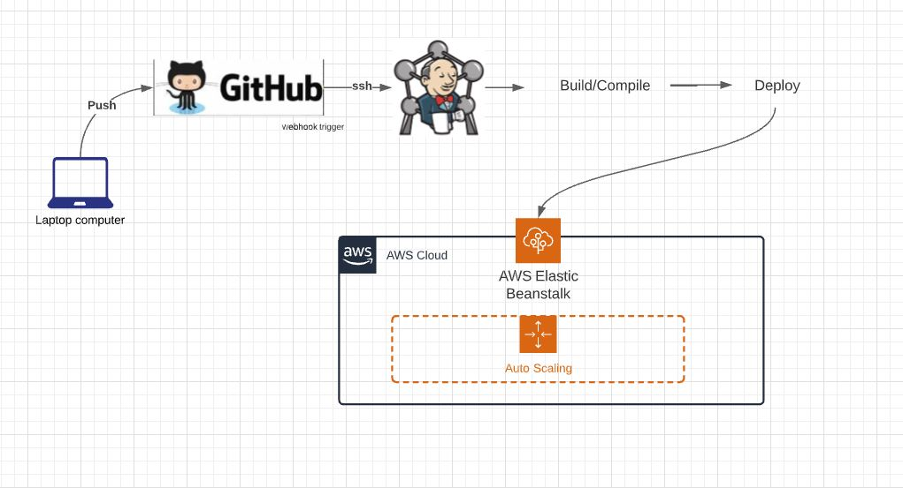

# beanstalk-deployment 

Jenkins Deploy to AWS Beanstalk
Creating AWS Elastic Beanstalk Environment (Autoscaling group with 2 servers, the number of servers does not matter, the important thing is high availability)
1) Developer doing a push to main GitHub
2) GitHub webhook/trigger to Jenkins
3) Jenkins starting Build/Compile 
4) Jenkins Deploy to the AWS Elastic Beanstalk 
5) AWS Elastic Beanstalk updating with the new version of web/app
